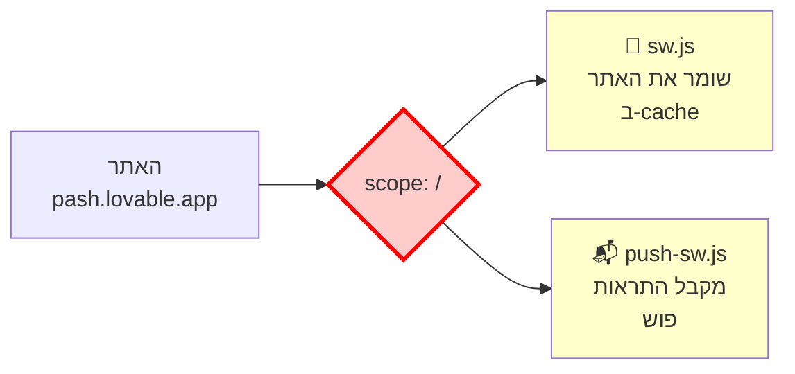
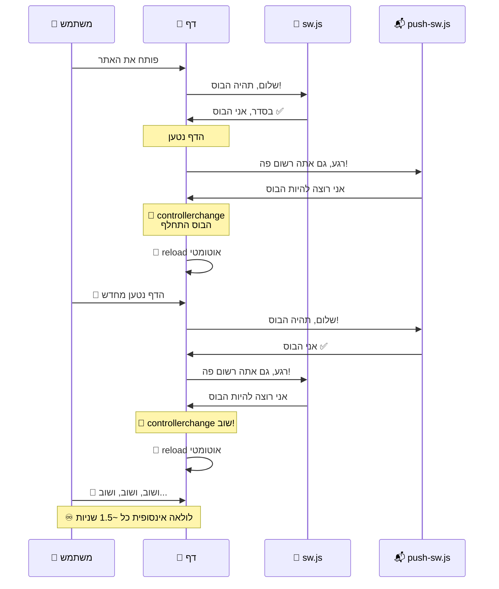
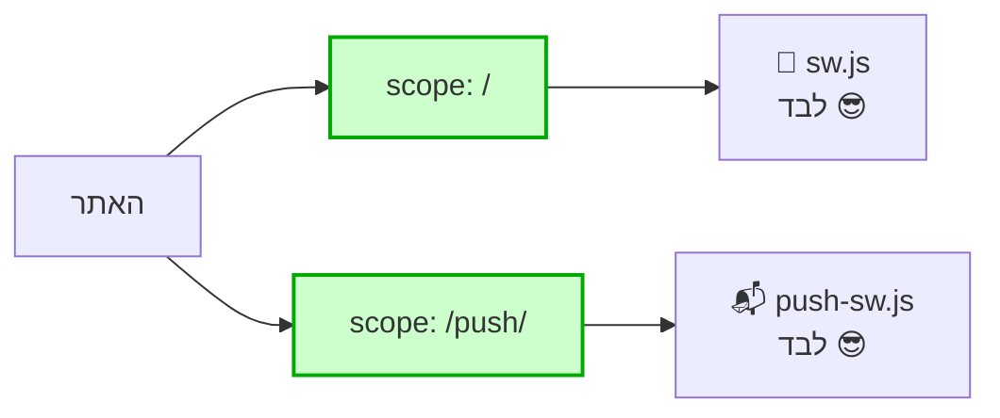
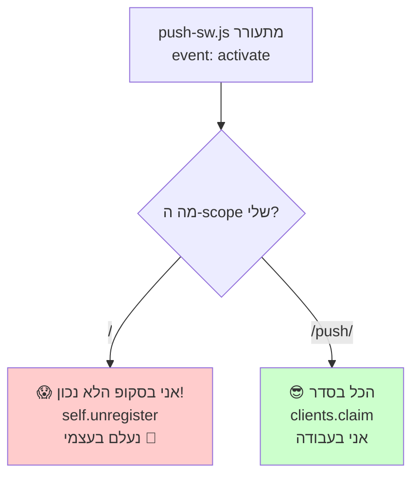

# 🐛 הסיפור המלא של הבאג שתפסנו – הסבר לילד בן 12

> **TL;DR**: באתר `https://pash.lovable.app` הדף קפץ ונטען מחדש כל ~1.5 שניות בלי הפסקה. הסיבה: **שני "עוזרים" של הדפדפן רבו על אותו מקום**. תיקנו ב-3 שכבות הגנה כדי שזה לא יחזור.

---

## חלק 1️⃣: היכרות עם הדמויות 🎭

### 🤖 מי זה Service Worker?

תארו לעצמכם שיש לכם **עוזר זעיר** שגר בתוך הדפדפן.
שמו **Service Worker** (נקצור: **SW**).

מה הוא עושה?

| תפקיד | למה זה טוב? |
|---|---|
| 📦 שומר עותק של האתר במחשב | הדף נטען מהר גם בלי אינטרנט |
| 📬 מקבל **התראות פוש** מהשרת | ההתראות מגיעות גם כשהאתר סגור |
| 🔄 מעדכן את האתר בשקט | אתם תמיד רואים את הגרסה החדשה |

### 🚦 החוק הכי חשוב על Service Worker:

> **לכל "אזור" באתר יכול להיות רק עוזר אחד.**
>
> ה"אזור" נקרא **scope** (סקופ).
> אם הסקופ הוא `/` זה אומר **"כל האתר".**
> אם הסקופ הוא `/push/` זה אומר **"רק התיקייה /push/".**

---

## חלק 2️⃣: איך נכנסנו לבאג? 🪤

באתר שלנו רשמנו, בלי לשים לב, **שני עוזרים שונים** – ושניהם ביקשו את אותו אזור (`/` = כל האתר):



הדפדפן הסתכל על זה ואמר:

> 🤔 *"רגע, יש לי שני עוזרים שרוצים להיות הבוס של אותו אזור. מי הבוס עכשיו?"*

ואז הוא עשה משהו הגיוני אבל הרסני: **התחיל להחליף ביניהם בלולאה**.

---

## חלק 3️⃣: למה זה הפך ללולאה אינסופית? 🌀

לעוזר הראשון (`sw.js`) הגדרנו תכונה בשם **`registerType: 'autoUpdate'`**.

המשמעות: *"ברגע שאתה מזהה שיש 'בוס חדש' בעיר, רענן את הדף אוטומטית כדי להראות למשתמש את הגרסה החדשה!"*

זה רעיון מצוין... **כשבאמת יש גרסה חדשה**.

אבל אצלנו לא הייתה גרסה חדשה. ה"בוס" התחלף כל הזמן רק כי שני העוזרים רבו. אז קרה דבר כזה:



**5 רענונים תוך 8 שניות.** הדף לא הצליח לחיות אפילו 2 שניות לפני שנטען מחדש. המשתמש ראה רק "קפיצה" אינסופית. 😵

---

## חלק 4️⃣: איך תפסנו את זה? 🔍

נכנסתי לאתר עם כלי בדיקה אוטומטי (Playwright + DevTools) ושמתי לב לשלושה דברים מוזרים:

| 🚨 סימן | מה זה אמר |
|---|---|
| 5 ניווטים לאותו URL ב-8 שניות | הדף ממש נטען מחדש כל הזמן |
| `swState: "activating"` | העוזר תקוע במצב "כמעט מוכן" – לא מסיים אף פעם |
| `CLS: 0` (אפס תזוזות) | למרות שהמשתמש "רואה קפיצות" – לא היו תזוזות אמיתיות |

הבנתי שמה שהמשתמש קורא לו "האתר קופץ" **זה לא בעיית עיצוב או רינדור** – אלא **ממש רענון מלא של הדף שוב ושוב**.

זה היה **רמז ענק**: 🎯 **הבעיה היא בעוזר (SW), לא בקוד הרגיל של האתר.**

---

## חלק 5️⃣: התיקון – שלוש שכבות הגנה 🛡️🛡️🛡️

תיקון אחד לא הספיק כי גילינו שהבעיה עמוקה יותר ממה שחשבנו. בנינו **שלוש שכבות הגנה**, כך שגם אם אחת לא מצליחה – האחרות תופסות.

### 🛡️ שכבה 1: scope נפרד

נתנו לעוזר השני אזור משלו, רחוק מהראשון:



**הקוד שהשתנה:**
```ts
// ❌ לפני (גרם לבאג):
navigator.serviceWorker.register("/push-sw.js", { scope: "/" });

// ✅ אחרי:
navigator.serviceWorker.register("/push-sw.js", { scope: "/push/" });
```

### 🛡️ שכבה 2: ניקוי מהדף

יש משתמשים שכבר ביקרו באתר – אצלם הרישום הישן הבעייתי **כבר שמור בדפדפן**. הם לא מקבלים תיקון אוטומטית. לכן הוספנו קוד שאומר:

> *"כשהאתר נטען, תבדוק אם יש רישום ישן של `push-sw.js` באזור `/`. אם כן – תוריד אותו מהדפדפן."*

```ts
const regs = await navigator.serviceWorker.getRegistrations();
for (const r of regs) {
  const slots = [r.active?.scriptURL, r.waiting?.scriptURL, r.installing?.scriptURL];
  const hasPushSW = slots.some(s => s?.endsWith("/push-sw.js"));
  if (hasPushSW && new URL(r.scope).pathname === "/") {
    await r.unregister(); // 🧹 מנקים את הישן
  }
}
```

⚠️ **חשוב לבדוק את כל 3 ה"סלוטים"** של ה-SW (active / waiting / installing). בגרסה הראשונה בדקנו רק את הראשון – ופספסנו רישומים שה-`push-sw.js` היה דווקא ב-WAITING.

### 🛡️ שכבה 3: ה-SW עושה Self-Destruct 💣

מה אם המשתמש כל כך תקוע בלולאה שהקוד של הדף בכלל לא רץ? הפתרון הכי חזק: **ה-SW עצמו ירפא את עצמו**.

שינינו את `push-sw.js` כך שכשהוא מתעורר (event `activate`), הוא בודק את ה-scope שלו:



**הקוד:**
```js
self.addEventListener("install", () => {
  self.skipWaiting(); // אל תחכה בתור – תיכנס לפעולה מיד!
});

self.addEventListener("activate", (event) => {
  event.waitUntil((async () => {
    const scopeUrl = new URL(self.registration.scope);
    if (scopeUrl.pathname === "/") {
      // אופס, אני בסקופ הלא נכון – נעלם!
      await self.registration.unregister();
      return;
    }
    await self.clients.claim();
  })());
});
```

זה **פתרון יציב במיוחד** כי:
- ✅ רץ בתוך ה-SW עצמו, **לא תלוי בקוד האפליקציה**
- ✅ רץ אפילו אם הדף תקוע בלולאת רענון
- ✅ עובד גם אם הדפדפן קאש ישן של האפליקציה

---

## חלק 6️⃣: התוצאה 🎉

### לפני התיקון:
```
⏱️ 8 שניות מעקב
🔁 5 ניווטים (רענון כל 1.5 שניות)
❌ swState: activating (תקוע)
❌ הדף לא שמיש
```

### אחרי התיקון:
```
⏱️ 12 שניות מעקב
✅ 0 ניווטים (יציב)
✅ 0 רענונים
✅ swState: activated (תקין)
✅ הדף עובד מצוין
```

---

## חלק 7️⃣: איך נמנע מזה בעתיד? 🚧

יש 4 כללי זהב שלמדנו מהבאג הזה:

### 1️⃣ **לעולם** אל תרשמו 2 SW לאותו scope

אם יש לכם PWA (`vite-plugin-pwa`) **וגם** Push Notifications, או:
- 🅰️ **תנו לכל אחד scope משלו** (`/` ו-`/push/`).
- 🅱️ או **מזגו את שניהם לקובץ SW אחד**.

### 2️⃣ הוסיפו `skipWaiting()` ל-install של כל SW שלכם

אחרת SW חדש יכול להיתקע בתור (WAITING) ואף פעם לא ירוץ.

### 3️⃣ הוסיפו "self-heal" ל-activate

ה-SW אמור לבדוק את עצמו ולתקן את עצמו אם הוא במצב לא נכון. זה ההגנה האחרונה כשכל השאר נכשל.

### 4️⃣ אל תניחו ש"קפיצה" באתר = בעיית CSS

לפעמים מה שנראה כמו "תזוזה" הוא ממש **רענון מלא של הדף שלא נגמר**. תמיד תבדקו ב-DevTools את לשונית **Application → Service Workers** קודם.

---

## נספח: פקודות שימושיות ל-DevTools 🛠️

אם אתה חושב שיש לך את הבאג הזה באתר שלך:

```javascript
// הדבק בקונסול ובדוק כמה SW יש לך ובאיזה scope
const regs = await navigator.serviceWorker.getRegistrations();
console.table(regs.map(r => ({
  scope: r.scope,
  active: r.active?.scriptURL,
  waiting: r.waiting?.scriptURL,
})));
```

```javascript
// אם יש לך באג – הדבק את זה לניקוי מלא
const regs = await navigator.serviceWorker.getRegistrations();
for (const r of regs) await r.unregister();
const cs = await caches.keys();
for (const n of cs) await caches.delete(n);
location.reload();
```

---

## 📋 קבצים שהשתנו בתיקון

| קובץ | מה שונה |
|---|---|
| [src/services/webPushService.ts](../src/services/webPushService.ts) | scope `/push/` + ניקוי רישום ישן |
| [public/push-sw.js](../public/push-sw.js) | `skipWaiting` + self-heal ב-activate |

## 📜 Commits

```
06f053f  fix(sw): push-sw.js skipWaiting on install so self-heal can run
3f0913e  fix(sw): make push-sw.js self-unregister when activated at wrong scope
85f526c  fix(sw): also nuke root-scope push-sw.js when it's in the WAITING slot
c629aaa  fix(sw): scope push-sw to /push/ to stop production reload loop
```

---

## 🎓 הלקח הגדול

> **שני בוסים = אין בוס.**
>
> כשאתה מתכנן Service Workers, תזכור את החוק: **scope אחד = SW אחד.**
> אם אתה צריך כמה SW – תן לכל אחד אזור משלו.
>
> וכשמשהו נראה מוזר – אל תתחיל מ-CSS.
> תתחיל מ-DevTools → Application → Service Workers.
> שם תמצא 90% מהבאגים האלה.

🧠✨
